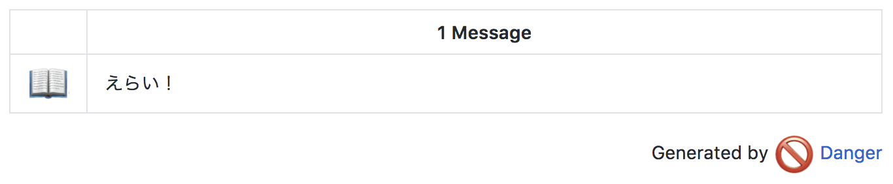

# danger-homete

[](https://rubygems.org/gems/danger-homete)

danger-homete.



## Installation

### gem

```
$ gem install danger-homete
```

### Bundler

Add the following line to your Gemfile and then run `bundle install`:

```
gem 'danger-homete'
```


## Usage

Just add this line to your `Dangerfile`:

```ruby
homete.test_files = ["*spec.rb", "*Test.java"]
homete.homete(["すごい！","えらい！","がんばった！"])
```